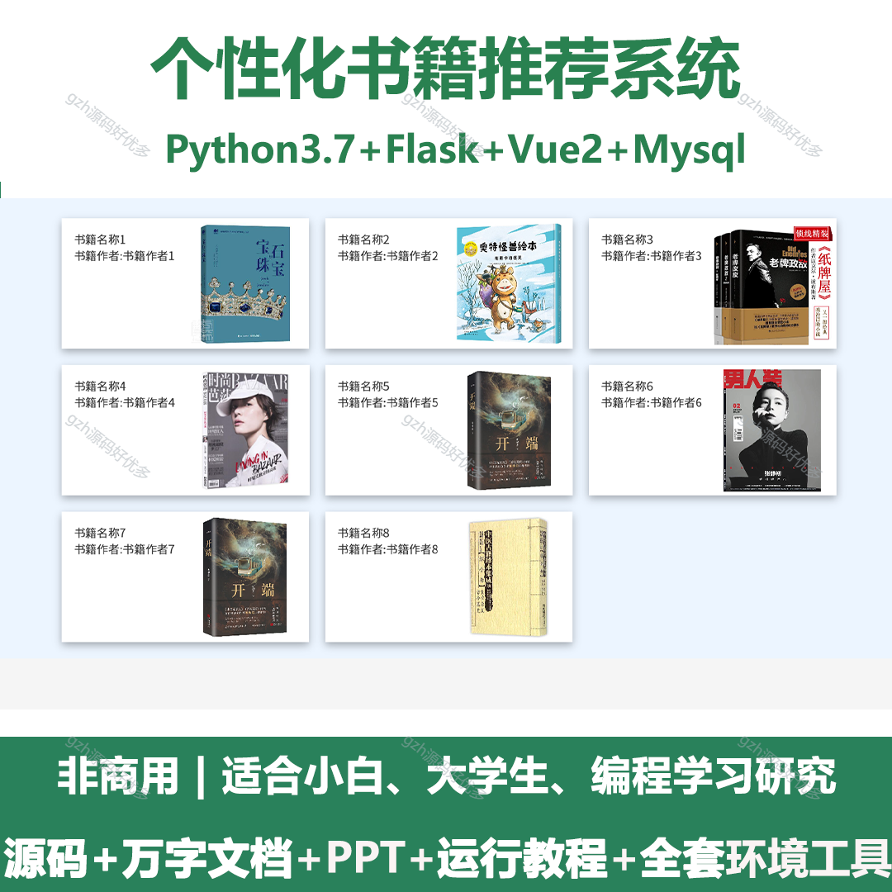
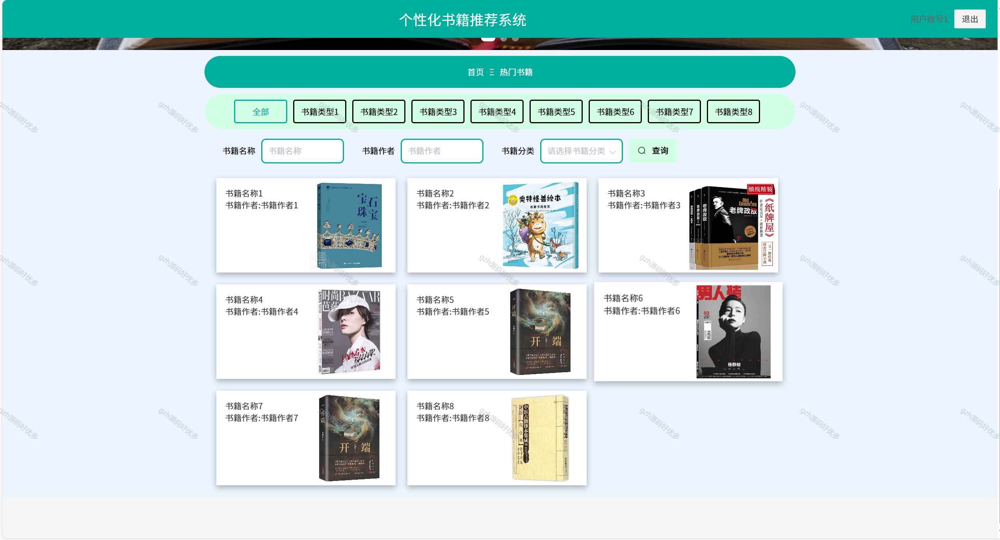
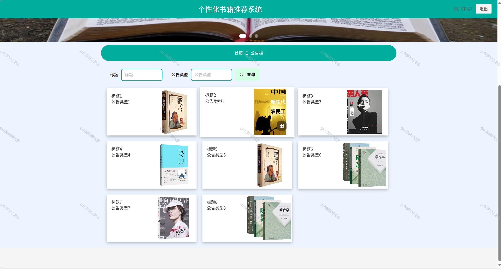
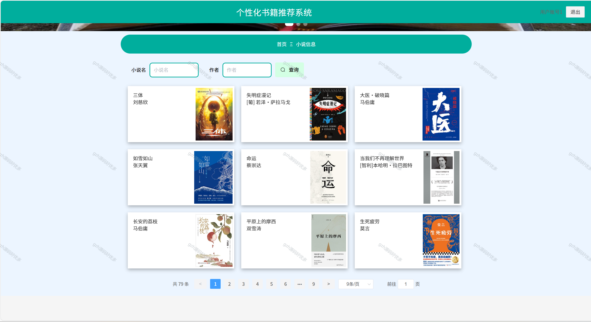
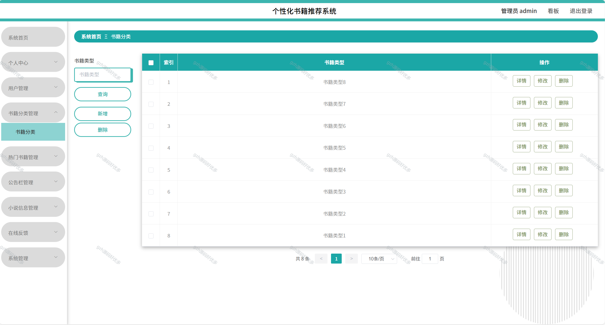
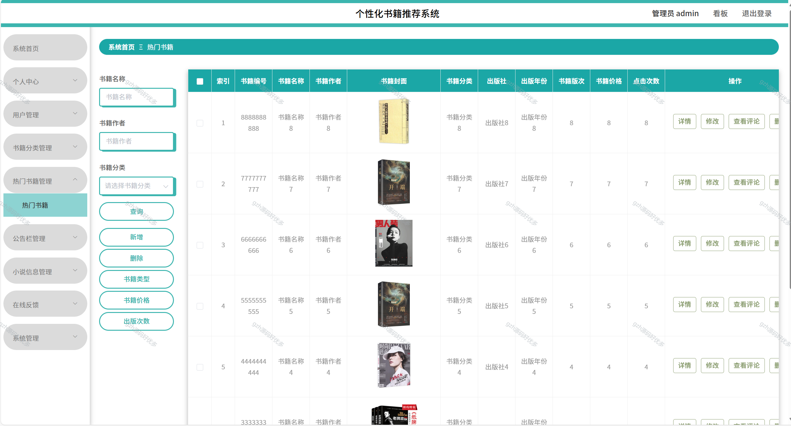
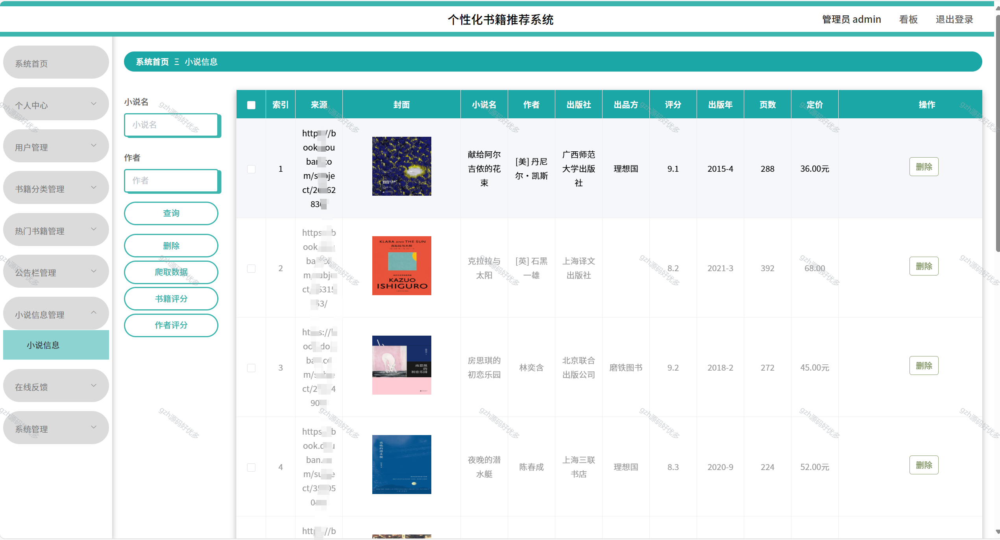
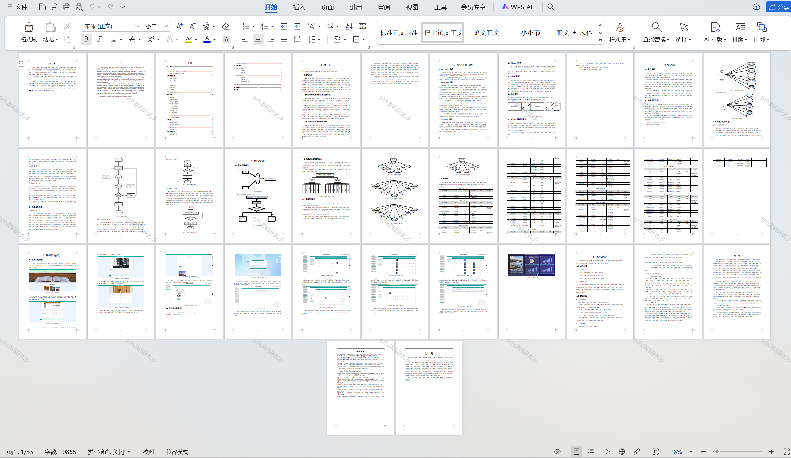

# python095
python095基于Python+Flask的个性化书籍推荐系统+LW+PPT
 
## 查看主页获取源码

### 一、关键词
个性化图书推荐系统，定制化书籍推荐系统，基于用户的书籍推荐系统

### 二、作品包含
源码+数据库+设计文档万字+PPT+全套环境和工具资源+本地部署教程

### 三、项目技术
前端技术：Vue2.0、Element-ui
后端技术：Python3.7、Flask

### 四、运行环境（以下版本亲测，其他版本兼容性请自行测试）
开发工具：PyCharm + VSCODE

数据库：MySQL5.7（最低要5.7版本）

数据库管理工具：Navicat10+

Python：Python3.7

前端Nodejs：14

浏览器：谷歌浏览器

### 五、项目介绍
项目编号：python095

这个系统的设计主要包括系统页面的设计和方便用户互动的后端数据库，而前端软件的开发则需要良好的数据处理能力、友好的界面和易用的功能。
数据要被工作人员通过界面操作传输至数据库中。通过研究，以MySQL为后端数据库，以PYTHON为前端技术，以IDEA为开发平台，采用DJANGO架构，建立一个提供个人中心、用户管理、书籍分类管理、热门书籍管理、公告栏管理、小说信息管理、在线反馈、系统管理等必要功能的、稳定的个性化书籍推荐系统。

### 六、运行截图

